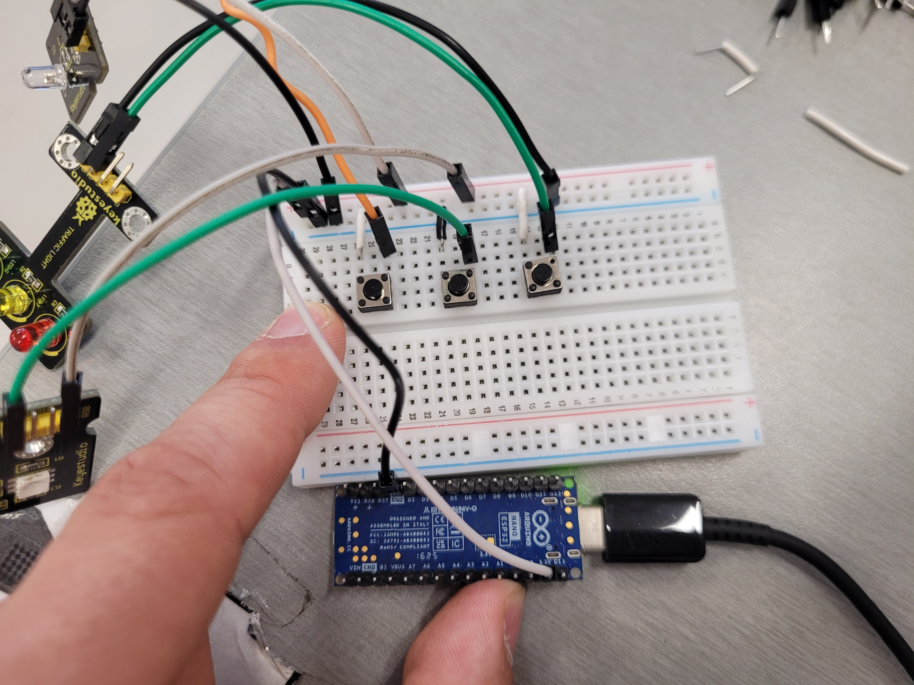
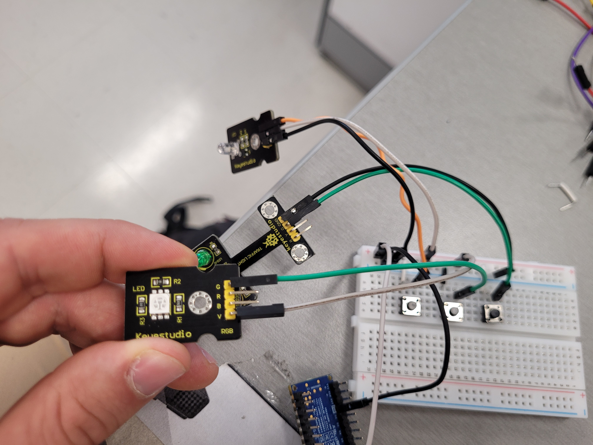
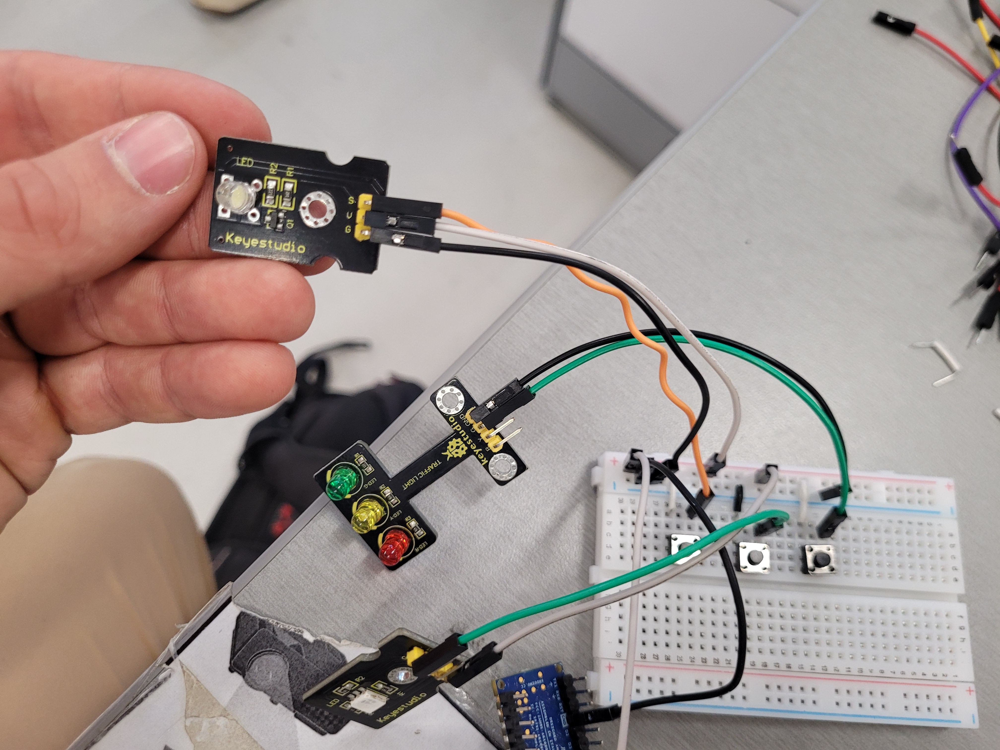
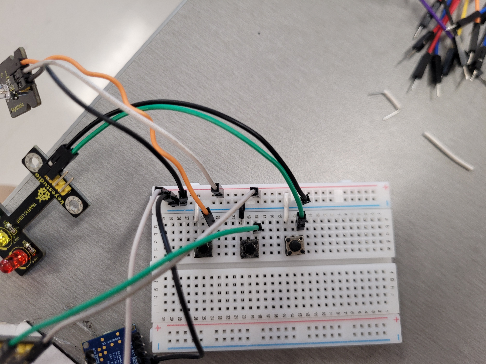
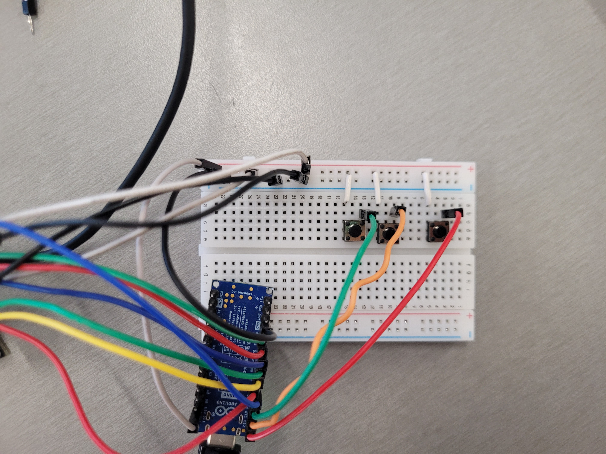
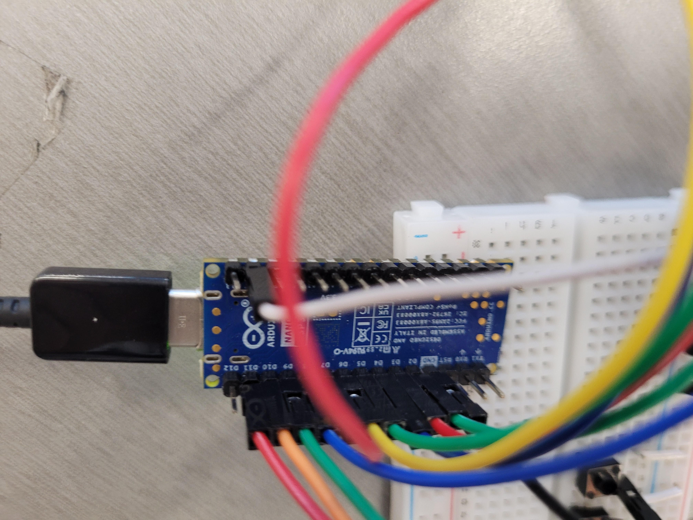
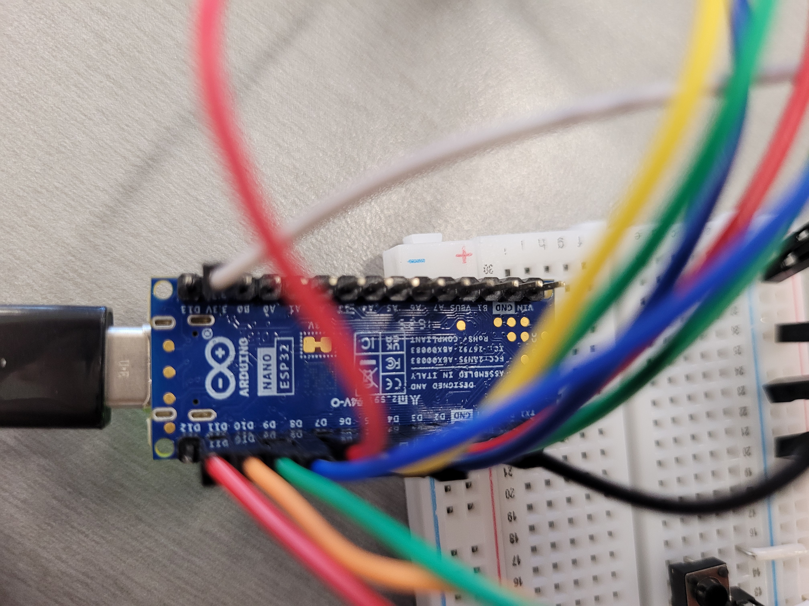
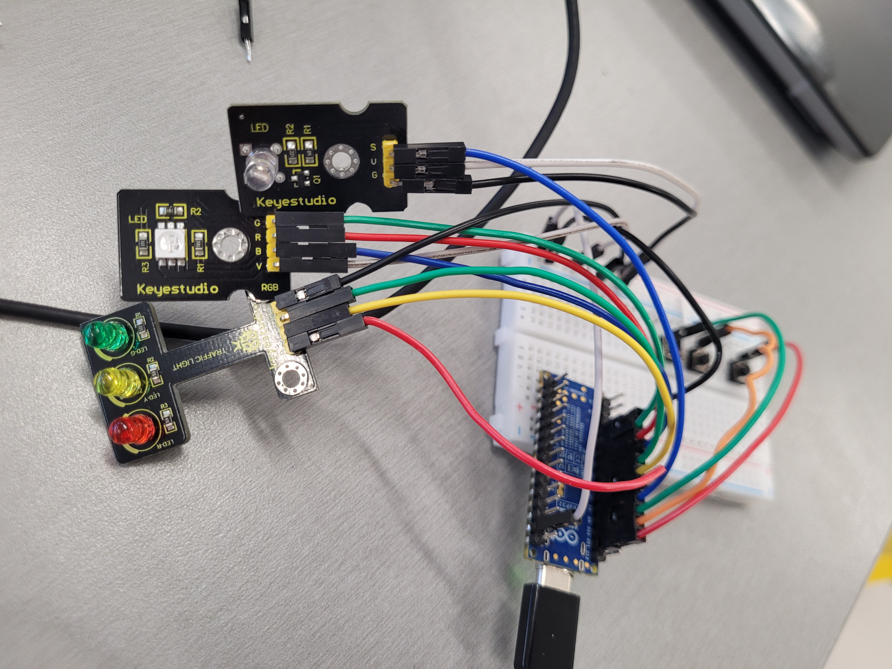

+++
type = "chapter"
title = "Formatif intra 1"
date = 2026-06-12T16:54:59-04:00
draft = false
weight = 5.5
pre = ""
+++
---
Il y aura une partie théorique sur Moodle. Je ne vous fournis pas de formatif pour cette partie. Elle portera sur tout ce que nous avons vu jusqu'à présent, mais il n'y aura pas de code. Pensez, entre autres, à réviser « V = RI ». 

La partie pratique ci-dessous est plus longue que ce qui sera proposé à l'examen. L'examen comportera environ 2 ou 3 problèmes, qui seront d'un niveau de difficulté similaire aux projets ci-dessous.

### Examen - Projet 1 : Système de contrôle direct de LED par boutons


#### 1. Contexte et Objectif

Le but de ce projet est de concevoir un système interactif de base permettant de piloter des sources lumineuses de manière indépendante à l'aide de boutons poussoirs.

#### 2. Matériel à disposition

* 1 Microcontrôleur
* 2 Boutons poussoirs (A et B)
* 1 LED blanche (avec résistance de protection adaptée)
* 1 LED de signalisation
* Fils de câblage et plaque d'essai (breadboard)

#### 3. Travail demandé

Écrire un programme informatique permettant de réaliser le comportement suivant :

* Lorsque l'utilisateur appuie sur le **bouton A**, la **LED blanche** s'allume.
* Lorsque l'utilisateur appuie sur le **bouton B**, la **LED RGB** s'allume en couleur **verte**.
* Lorsque les boutons sont relâchés, les LED correspondantes doivent s'éteindre.


{}






{}

---

### Examen - Projet 2 : Interface de contrôle séquentiel et bascule

#### 1. Contexte et Objectif

On souhaite perfectionner le système précédent en introduisant la gestion d'états logiques (bascule) et l'utilisation de structures de données de type tableau pour la gestion des couleurs d'une LED RGB.

#### 2. Matériel à disposition

* Le même matériel que le Projet 1 (2 boutons, 1 LED blanche, 1 LED RGB).

#### 3. Travail demandé

Développer le programme en respectant les exigences fonctionnelles ci-dessous :

1. **Gestion du Bouton A (Interrupteur On/Off) :** Chaque pression sur le bouton A doit inverser l'état de la LED blanche (si elle était éteinte, elle s'allume ; si elle était allumée, elle s'éteint).
2. **Gestion du Bouton B (Défilement de couleurs) :** Déclarer un tableau contenant au moins 3 valeurs de couleurs RGB distinctes. Chaque pression sur le bouton B doit faire passer la LED RGB à la couleur suivante dans le tableau (avec un retour automatique au début du tableau après la dernière couleur).


{}
Il y a un bouton de trop ici. Il sera utilisé à la solution 3.






```python
import machine
from pins import Pins 
import time

# Mise en place
rgb_vert = machine.Pin(Pins.D2, machine.Pin.OUT)
rgb_rouge = machine.Pin(Pins.D3, machine.Pin.OUT)
rgb_blue = machine.Pin(Pins.D4, machine.Pin.OUT)

sign_vert = machine.Pin(Pins.D5, machine.Pin.OUT)
sign_jaune = machine.Pin(Pins.D6, machine.Pin.OUT)
sign_rouge = machine.Pin(Pins.D7, machine.Pin.OUT)

led = machine.Pin(Pins.D8, machine.Pin.OUT)

btn_B_rgb = machine.Pin(Pins.D9, machine.Pin.IN, machine.Pin.PULL_DOWN)
btn_B_sign = machine.Pin(Pins.D10, machine.Pin.IN, machine.Pin.PULL_DOWN)
btn_A = machine.Pin(Pins.D11, machine.Pin.IN, machine.Pin.PULL_DOWN)

# Tests et initialisations
rgb_vert.value(1)
rgb_rouge.value(1)
rgb_blue.value(1)
# time.sleep(1)
# rgb_vert.value(0)
# rgb_rouge.value(1)
# rgb_blue.value(1) 
# time.sleep(1) 
# rgb_vert.value(1)
# rgb_rouge.value(0)
# rgb_blue.value(1)
# time.sleep(1)
# rgb_vert.value(1)
# rgb_rouge.value(1)
# rgb_blue.value(0)
# time.sleep(1)

sign_vert.value(0)
sign_rouge.value(0)
sign_jaune.value(0)
# time.sleep(1)

# sign_vert.value(1)
# sign_rouge.value(0)
# sign_jaune.value(0)
# time.sleep(1)

# sign_vert.value(0)
# sign_rouge.value(1)
# sign_jaune.value(0)
# time.sleep(1)

# sign_vert.value(0)
# sign_rouge.value(0)
# sign_jaune.value(1)
# time.sleep(1)

led.value(0)
# time.sleep(1)
# led.value(1)
# time.sleep(1)
# led.value(0)


cur_A = btn_A.value()
prev_A = cur_A

cur_B_sign = btn_B_sign.value()
prev_B_sign = cur_B_sign

cur_B_rgb = btn_B_sign.value()
prev_B_rgb = prev_B_sign

# Préparation pour alternance de couleur

def allume_couleur_rgb(couleur):
    if couleur == "rouge":
            rgb_rouge.value(0)
            rgb_blue.value(1)
            rgb_vert.value(1)
    elif couleur == "vert":
            rgb_rouge.value(1)
            rgb_blue.value(1)
            rgb_vert.value(0)

    elif couleur == "jaune":
            rgb_rouge.value(0)
            rgb_blue.value(1)
            rgb_vert.value(0)

def allume_couleur_sign(couleur):
    if couleur == "rouge":
        sign_rouge.value(1)
        sign_vert.value(0)
        sign_jaune.value(0)
        
    elif couleur == "vert":
        sign_rouge.value(0)
        sign_vert.value(1)
        sign_jaune.value(0)
    elif couleur == "jaune":
        sign_rouge.value(0)
        sign_vert.value(0)
        sign_jaune.value(1)

tableau_couleur = ["rouge", "jaune", "vert"]
compteur_rgb = 0
compteur_sign = 0
while True:
    cur_A = btn_A.value()
    cur_B_sign = btn_B_sign.value()
    cur_B_rgb = btn_B_rgb.value()
    if cur_A != prev_A and cur_A == 0:
        led.value(not led.value())
    if cur_B_rgb != prev_B_rgb and cur_B_rgb == 0:
        compteur_rgb = (compteur_rgb + 1) % len(tableau_couleur)
        allume_couleur_rgb(tableau_couleur[compteur_rgb])
    if cur_B_sign != prev_B_sign and cur_B_sign == 0:
        compteur_sign = (compteur_sign + 1) % len(tableau_couleur)
        allume_couleur_sign(tableau_couleur[compteur_sign])
    prev_A = cur_A
    prev_B_sign = cur_B_sign
    prev_B_rgb = cur_B_rgb
    time.sleep(0.05)

```

{}

---

### Examen - Projet 3 : Le jeu de réflexes interactif

**Matière :** Développement de Projets Interactifs

#### 1. Contexte et Objectif

Réaliser un mini-jeu de rapidité mesurant le temps de réaction entre deux joueurs ou évaluant la réactivité d'un utilisateur face à un stimulus visuel aléatoire.

#### 2. Matériel à disposition

* 2 Boutons poussoirs (Joueur A et Joueur B)
* 1 LED blanche

#### 3. Travail demandé


* Le système génère un temps d'attente aléatoire, au terme duquel la **LED blanche** s'allume brusquement.
* Le premier utilisateur à appuyer sur son bouton (A ou B) remporte la manche. Affiche le temps de réaction du gagnant.
* Si l'utilisateur B effectue un appui prolongé à la fin du jeu, une nouvelle manche commence.
* (indice : utilisez `time.ticks_ms()` qui est un compteur du temps en millisecondes depuis le démarage)

{}
Le montage est le même qu'à la solution 2, mais vous pouvez ignorer les LEDs de couleurs.


```python
import machine
from pins import Pins 
import time
import random
# Mise en place
rgb_vert = machine.Pin(Pins.D2, machine.Pin.OUT)
rgb_rouge = machine.Pin(Pins.D3, machine.Pin.OUT)
rgb_blue = machine.Pin(Pins.D4, machine.Pin.OUT)

sign_vert = machine.Pin(Pins.D5, machine.Pin.OUT)
sign_jaune = machine.Pin(Pins.D6, machine.Pin.OUT)
sign_rouge = machine.Pin(Pins.D7, machine.Pin.OUT)

led = machine.Pin(Pins.D8, machine.Pin.OUT)


btn_A = machine.Pin(Pins.D10, machine.Pin.IN, machine.Pin.PULL_DOWN)
btn_B = machine.Pin(Pins.D11, machine.Pin.IN, machine.Pin.PULL_DOWN)

# Tests et initialisations
rgb_vert.value(1)
rgb_rouge.value(1)
rgb_blue.value(1)
# time.sleep(1)
# rgb_vert.value(0)
# rgb_rouge.value(1)
# rgb_blue.value(1) 
# time.sleep(1) 
# rgb_vert.value(1)
# rgb_rouge.value(0)
# rgb_blue.value(1)
# time.sleep(1)
# rgb_vert.value(1)
# rgb_rouge.value(1)
# rgb_blue.value(0)
# time.sleep(1)

sign_vert.value(0)
sign_rouge.value(0)
sign_jaune.value(0)
# time.sleep(1)

# sign_vert.value(1)
# sign_rouge.value(0)
# sign_jaune.value(0)
# time.sleep(1)

# sign_vert.value(0)
# sign_rouge.value(1)
# sign_jaune.value(0)
# time.sleep(1)

# sign_vert.value(0)
# sign_rouge.value(0)
# sign_jaune.value(1)
# time.sleep(1)

led.value(0)
# time.sleep(1)
# led.value(1)
# time.sleep(1)
# led.value(0)
while True:
    print("Soyez pret ?")
    time.sleep(1)
    led.value(0)
    time.sleep(random.randint(2, 6))
    print("Go")
    led.value(1)
    depart = time.ticks_ms()
    cur_A = btn_A.value()
    prev_A = cur_A

    cur_B = btn_B.value()
    prev_B = cur_B
    while True:
        cur_A = btn_A.value()
        cur_B = btn_B.value()
        if prev_A != cur_A and cur_A == 0:
            print(f"A gagne avec un temps de : {time.ticks_ms() - depart} ms")
            break
        if prev_B != cur_B and cur_B == 0:
            print(f"B gagne avec un temps de : {time.ticks_ms() - depart} ms")
            break
        prev_B = cur_B
        prev_A = cur_A
        time.sleep(0.005)

    needBreak = False
    while not needBreak:

        if btn_B.value() == 1:
            temps_appui = time.ticks_ms()
            while True:
                if btn_B.value() == 0:
                    break
                elif time.ticks_ms() - temps_appui > 2000:
                    
                    needBreak = True
                    break
```
{}

---

### Examen - Projet 4 : Simulateur de carrefour et contrôle d'accès


#### 1. Contexte et Objectif

Concevoir un système de contrôle de circulation combinant un feu tricolore et une gestion d'état sécurisée à l'aide de plusieurs entrées (boutons).

#### 2. Matériel à disposition

* 1 Boutons poussoirs (ex: Piéton)
* 1 LED blanche (Indicateur piéton / alerte)
* 1 LED RGB (Feu tricolore : Rouge, Orange, Vert)

#### 3. Travail demandé

La lumière passe du rouge au vert, puis au jaune en alternance. Si on clique sur le bouton, elle reste au rouge plus longtemps et le feu piéton blanc s'allume. Les lumières verte et rouge sont allumées normalement pendant 5 secondes, la jaune pendant 1 seconde, et la blanche pendant 5 secondes.
